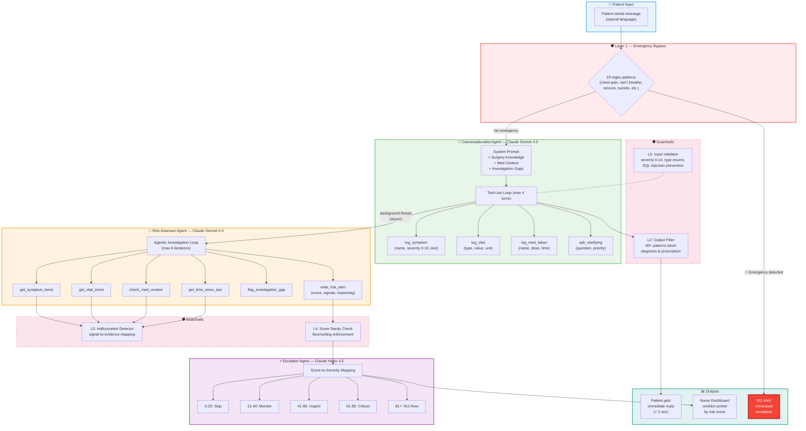
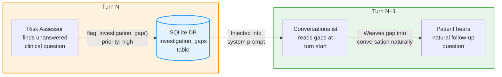
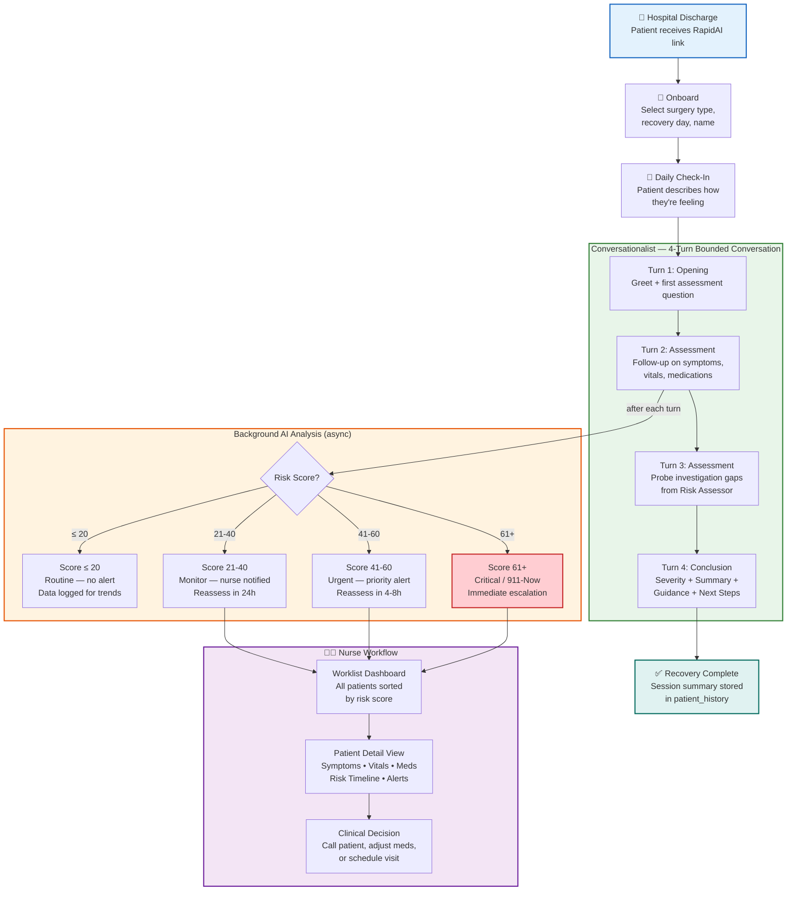
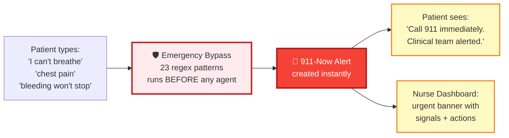
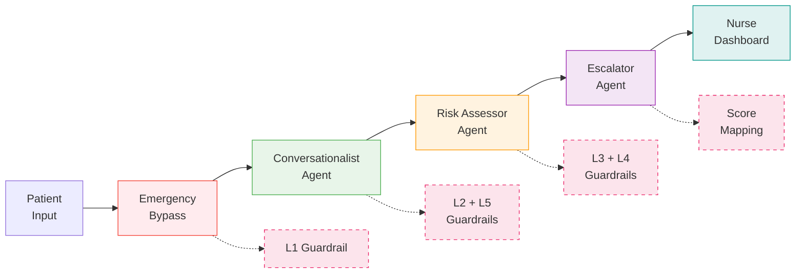

# RapidAI — Product Requirements Document & Roadmap

Our solution provides continuous, personalized monitoring and clinical guidance to post-surgical patients at home, enabling early detection of complications and reducing preventable readmissions through real-time clinician visibility into patient recovery.

---

## 0. PROBLEM DEFINITION

### What problem is this solving?

**The Problem:** Post-surgical patients are discharged home without continuous professional oversight, leaving them uncertain about normal recovery versus warning signs while clinicians have zero visibility into their progress. This care gap results in delayed detection of complications, preventable readmissions, and billions in avoidable healthcare costs.

**Job to Be Done:**

- **For Patients:** Enable me to recover confidently at home by providing personalized guidance, timely reassurance, and immediate access to clinical support when I need it.
- **For Clinicians:** Provide me with real-time visibility into the recovery of discharged patients, enabling me to detect complications early, intervene proactively, and prevent hospital readmissions at scale.

### Who are you solving this problem for?

**1. ORTHOPEDIC SURGERY (Beachhead Market)**

Why Start Here:
- Highest volume: 1M+ joint replacements/year in the US alone
- Predictable complications: Infection, DVT, pain management — all detectable
- 90-day bundled payments: Hospitals own the financial risk for readmissions
- Tech-savvy patients: Typically 45-75 years old, educated, smartphone users
- Clear ROI: Average readmission costs $15-20K per case

**Persona:**

Sarah (Patient), Age 60, Knee Replacement, post-op recovery phase
- **Primary Need:** 24/7 support and reassurance during recovery
- **Key Pain Point:** Anxiety about symptoms and uncertainty about what's normal
- **Success Metric:** Peace of mind, reduced anxiety, and avoidance of readmission
- **Willingness to Pay:** $10-20/month (self-pay)

### Why is this Problem worth solving?

**1. The Gap Is Large, Costly, and Dangerous**
- 44-56% of post-op complications occur after patients leave the hospital — when they're alone, not continuously monitored, and at their highest risk.
- 14.67% of post-surgical readmissions are preventable, often because warning signs (swelling, clots, infection) were missed or escalated too late.
- Patient surveys reveal >70% feel anxious or "not sure what's normal" after leaving the hospital, leading to unnecessary ER visits or delayed intervention.
- Nurse burnout and turnover are at all-time highs (15-20% leave yearly), largely due to manual, unscalable post-discharge workflows and constant after-hours calls for issues that smarter tech could triage.
- Current "digital" tools are one-way (basic symptom checkers, SMS bots) — no real-time prediction, personalization, or context-aware triage.

**2. Generic AI Assistants (e.g., ChatGPT) Aren't Safe for This Use Case**
- Lack clinical context: They can't access or safely interpret real patient data, wound photos, or connect to medical records.
- Unpredictable hallucinations: ChatGPT and copilots are prone to "sounding confident" even when wrong — dangerous in medicine.
- No explainability for critical alerts: General AIs can't "show their work" with patient-specific logic, critical for FDA safety, trust, and clinical hand-off.
- No escalation safety net: They can't page a doctor, handle red flags, or integrate into real-world clinical workflows.

### RapidAI's Unique Solution and MOAT

| Challenge | Status Quo | ChatGPT/Copilots | RapidAI |
|---|---|---|---|
| Predict early risk | Manual, late | No personal data or prediction | Context-aware multi-agent AI with 21 red-flag rules, detects risk 2-3 days before symptoms |
| False alarms | High, frustrating | Random hallucinations | <10% false-positive via 5-layer guardrail system (hallucination detector, score sanity, input validator) |
| Photo/wearable data | Not used | Can't process/secure | Designed for wound photo analysis and device data integration |
| Explainability | Black-box/manual | Black-box logic | Patient-facing "why" via transparent reasoning + clinician audit trail with triggered signals |
| Human-in-the-loop | Overwhelmed | No escalation | Auto-escalates to nurse/doctor via Escalator agent; investigation gaps fed back to next conversation |
| Integration | Disconnected | No EMR linkage | REST API + WebSocket architecture designed for real-time EMR connectivity |
| Regulatory | Siloed | Not FDA-ready | 5-layer guardrails, full audit logging, emergency bypass patterns, severity validation |

### Why Agentic AI?

1. **Unstructured Data:** Patients submit descriptions in unpredictable formats. RapidAI uses Claude LLMs (Conversationalist agent) to interpret natural language, extract structured clinical data via tool calls (`log_symptom`, `log_vital`, `log_med_taken`), and combine all types of inputs for accurate real-world triage.

2. **Context Awareness:** Recovery is complex; what's concerning on Day 1 might be normal on Day 3 for a different surgery type. The Risk Assessor agent evaluates each case using surgery-specific timelines (expected pain curves, milestone windows), medication context (NSAID fever masking, opioid pain masking), and symptom trajectory patterns — whereas rigid automations miss these subtleties.

3. **Dynamic Planning & Escalation:** When faced with ambiguous symptoms, RapidAI's Risk Assessor runs an agentic investigation loop (up to 6 iterations) — calling tools to check symptom trends, vital trajectories, medication masking effects, and time-gap analysis. It can flag investigation gaps for the Conversationalist to probe in the next turn. Rule-based systems can't handle this adaptive reasoning.

4. **Real Decision-Making:** Recovery risks come in complex, overlapping combinations (mild swelling + pain language + activity drop). The 21-signal red flag matrix combined with agentic tool-use surfaces weak-signal risks that static rules would miss or over-alert on — reducing both missed complications and alert fatigue.

---

## 1. SOLUTION DEFINITION

### 1.1 Architecture Overview

RapidAI uses a **multi-agent orchestration** architecture with three specialized Claude-powered AI agents coordinated through a shared SQLite database:

#### Multi-Agent Pipeline

#### Inter-Agent Feedback Loop

> **Example:** Risk Assessor flags *"Ask about wound drainage character — is it serous or purulent?"* → Conversationalist asks naturally: *"You mentioned some drainage from your incision. Can you describe what it looks like — is it thin and watery, or thicker?"* → The patient never knows two agents are collaborating.

**Key Design Decisions:**
- **Sonnet for reasoning, Haiku for formatting:** Conversationalist and Risk Assessor require deep clinical reasoning (Sonnet ~$0.003-0.01/call). Escalator only translates scores to alerts (Haiku ~$0.001/call, skipped entirely for scores ≤15).
- **Background risk pipeline:** Patient gets immediate reply from Conversationalist. Risk assessment runs asynchronously so latency stays <3 seconds for patient-facing responses.
- **Investigation gap feedback loop:** Risk Assessor flags unanswered clinical questions → stored in DB → injected into Conversationalist's next turn as priority probes.

### 1.2 User Flows

#### Patient Journey — End to End

#### Emergency Path — Zero-Latency Bypass

### 1.3 Guardrail Architecture (5 Layers)

| Layer | Name | What It Does | When It Runs |
|---|---|---|---|
| L1 | Emergency Bypass | 23 regex patterns detect life-threatening keywords (chest pain, can't breathe, seizure, suicide). Immediately creates 911-now alert BEFORE any agent runs. | Before Conversationalist |
| L2 | Output Content Filter | 60+ regex patterns block diagnosis language ("you have an infection"), prescription language ("take 800mg ibuprofen"), and alarm language ("go to ER immediately"). Replaces with safe template. | After Conversationalist reply |
| L3 | Hallucination Detector | Maps each triggered risk signal to required evidence in actual patient data. Removes signals with no supporting symptoms/vitals. | After Risk Assessor |
| L4 | Score Sanity Check | Floor check (emergency symptoms must score ≥60), ceiling check (no data = max 20), consistency (high score + no signals → capped at 40). | After Risk Assessor |
| L5 | Tool Input Validator | Validates all agent tool calls: severity clamped 0-10, vital types checked against enum, text truncated to safe lengths, regex validation on names. | During Conversationalist tool calls |

### 1.4 Hallucination Mitigation

**What It Means Here:**
RapidAI could give a wrong, made-up, or misleading answer that isn't based on a patient's real symptoms, photos, or data.

**How We Mitigate:**
- **Layer 3 (Hallucination Detector):** 20+ signal-to-data mappings. Every risk signal (e.g., `fever_persistent`, `dvt_leg_swelling`) must have corresponding evidence in the patient's actual logged symptoms/vitals. Unsupported signals are stripped before scoring.
- **Layer 2 (Output Content Filter):** Conversationalist is prevented from making diagnostic claims ("you have an infection") or prescribing treatment. It can only describe symptoms, ask questions, and provide general guidance.
- **Tool-use architecture:** Instead of generating free-text clinical data, agents call structured tools (`log_symptom` with name/severity/free_text) — reducing hallucination surface area.
- **Few-shot clinical examples:** 4 synthetic scenarios embedded in system prompts teach agents correct clinical reasoning patterns (discriminating questions, timeline calibration, medication masking awareness).
- **Bounded conversations:** 4-turn limit prevents conversation drift and ensures structured conclusion.

### 1.5 Explainability

**What It Means Here:**
Every time RapidAI sends an alert or risk score, it transparently "shows its work."

**How We Implement:**
- **Risk Assessor reasoning:** Every `write_risk_alert` tool call includes a `reasoning` field explaining the clinical logic (e.g., "Pain reversal on Day 7 with low-grade fever while taking NSAIDs suggests possible infection — ibuprofen may be masking true temperature").
- **Triggered signals:** Each risk score includes a list of specific clinical signals (e.g., `["fever_persistent", "pain_reversal", "nsaid_fever_masking"]`) with their source data.
- **Escalator audit trail:** Nurse alerts include severity, headline, recommended actions, reassess timeline, and full rationale.
- **Investigation gaps:** When the Risk Assessor identifies unanswered clinical questions, these are logged with priority (high/medium/low) and source — visible to clinicians on the patient detail page.

---

## 2. FUNCTIONAL REQUIREMENTS

### Core Features (Implemented in MVP)

**1. Patient Onboarding**
- Scenario selection (7 pre-built clinical scenarios across 3 surgery types)
- Session creation with surgery type, recovery day, patient name
- Guided first-turn conversation with personalized opening

**2. Daily Symptom Check-In**
- Natural language conversation with Conversationalist agent (4-turn bounded)
- Structured data extraction via tool calls (symptoms with 0-10 severity, vitals with units, medications with doses)
- Turn-specific behavior: Opening → Assessment → Assessment → Conclusion

**3. Automated AI Symptom Assessment**
- Real-time analysis using surgery-specific clinical knowledge (expected pain curves, milestone windows)
- 21 red-flag rules evaluated against patient data (infection, DVT, respiratory, cardiac, wound, pain, medication signals)
- Medication masking detection (NSAIDs suppressing fever, opioids masking pain)
- Symptom trajectory analysis (improving → worsening pattern detection)

**4. Risk Detection & Escalation**
- Agentic investigation loop (Risk Assessor, up to 6 tool-call iterations)
- Score-to-severity mapping with automatic nurse alert generation
- Emergency bypass: Life-threatening keywords trigger immediate 911 alert before any agent processing
- Investigation gap tracking: unanswered clinical questions fed back to next conversation

**5. Nurse Worklist Dashboard**
- All active patients sorted by risk score (highest first)
- Summary stats: Active, Needs review, Monitoring, On track
- Urgent alert banners for high-risk patients
- Patient cards with risk color coding, status badges, triggered signals

**6. Patient Clinical Detail View**
- Symptom timeline with severity bars and trend indicators
- Vitals display with normal range context
- Medication history
- Risk score history with reasoning
- Alert history with severity and recommended actions
- Recovery timeline visualization (Day 1 → Day 7)

**7. Audit & Safety Logs**
- All messages logged with role, timestamp, session ID
- All tool calls logged (symptoms, vitals, meds) with exact values
- All risk scores logged with triggered signals and reasoning
- All alerts logged with severity, recommended action, citations
- Patient history records with key findings, unresolved concerns, session summary

### Out of Scope for MVP
- Telehealth & Communication Tools (video call integration)
- Patient Educational & Motivational Content (recovery tips, milestone celebrations)
- "Why did I get this alert?" button (explainability is in the data, UI button not built yet)
- Human-in-the-loop clinician confirmation workflow
- Wound photo upload and analysis
- Wearable device integration
- EMR/EHR integration

### 2.1 User Stories

**As a post-op patient:**
- I want to have a natural conversation about my recovery, so I don't need to navigate complex medical forms.
- I want the AI to remember what I said earlier in the conversation and ask relevant follow-up questions.
- I want to get clear, non-diagnostic guidance when something concerns me, so I understand what to watch for.
- I want to receive a structured conclusion with severity level and next steps after each check-in.
- I want life-threatening symptoms (chest pain, can't breathe) to trigger immediate emergency guidance.

**As a nurse or doctor:**
- I want to see all my patients sorted by risk score, so I can prioritize the most urgent cases.
- I want to see the AI's triggered signals and reasoning for any risk score, so I can trust and act on the assessment.
- I want to review symptoms, vitals, and medication history in one place for each patient.
- I want urgent alerts to include recommended actions and reassess timelines.
- I want the system to flag investigation gaps — things the AI couldn't determine and needs me to follow up on.

**As a product owner/regulator:**
- I want every AI action, tool call, and alert to be logged with data, timestamp, and session ID.
- I want life-threatening cases to be escalated to 911 guidance without any agent processing delay.
- I want the AI to never make diagnostic claims or prescribe medication (Layer 2 guardrail).
- I want hallucinated risk signals to be automatically stripped before scoring (Layer 3 guardrail).

### 2.2 Core Metrics

**NSM: Preventable Readmissions Avoided per 100 Monitored Patients**

| Metric | Target (Year 1) | Why It Matters |
|---|---|---|
| Complication Detection Rate | 75-85% | Proves AI works clinically |
| Time to Detection | 48-72 hrs early | Shows predictive capability |
| Patient Engagement (Check-Ins) | 80-85% | Proves adoption/stickiness |
| False Positive Rate | <10% | Avoids alert fatigue |
| Cost per Readmission Prevented | <$3,000 | Proves financial viability |

**Secondary Metrics:**

| Category | Metric | Target |
|---|---|---|
| AI Performance | Risk Assessor accuracy (signal precision) | 85%+ |
| AI Performance | Sensitivity (true positive detection) | 80%+ |
| AI Performance | Specificity (true negative rate) | 85%+ |
| AI Performance | Hallucination rate (L3 catches) | <5% of assessments |
| Platform | API response (Conversationalist reply) | <3 seconds |
| Platform | Risk pipeline completion (background) | <15 seconds |
| Platform | Uptime | 99.5%+ |
| UX | Check-in completion time | <3 minutes (4 turns) |
| UX | Chat message delivery | <2 seconds |
| UX | App crash rate | <0.5% |

---

## 3. PRIORITIZATION

### 3.1 Breaking the Agentic Workflow into Components

### 3.2 Component-Level Risk Assessment

| Component | Check | Result |
|---|---|---|
| **Emergency Bypass (L1)** | | |
| Is ML necessary? | PASS — Regex pattern matching is sufficient and faster. 23 emergency patterns are well-defined medical terms. No ML needed for this layer. | Rule-based |
| Can it scale? | PASS — O(1) regex matching, no API call, no latency. Handles unlimited concurrent checks. | Low risk |
| What are the laws? | CAUTION — Must not miss life-threatening keywords. False negatives here are the highest-risk failure mode. | Medium risk |
| **Conversationalist Agent** | | |
| Is ML necessary? | PASS — Natural language understanding of patient descriptions requires LLM. Rule-based systems can't parse "my leg feels funny and hot" into structured clinical data. | ML required |
| Do you have data to train? | PASS — 4 synthetic clinical scenarios as few-shot examples. Surgery-specific knowledge injected via system prompt. No fine-tuning needed (prompt engineering approach). | Sufficient |
| Can it meet accuracy requirements? | PASS — Tool-use architecture constrains outputs to structured data (severity 0-10, enumerated vital types). Layer 2 blocks unsafe language. Layer 5 validates tool inputs. | Guardrailed |
| Can it scale? | CAUTION — Each conversation turn costs ~$0.003-0.01 (Sonnet). 4 turns/session = ~$0.02-0.04/patient. At 10K patients/day = $200-400/day. | Medium risk |
| How fast can you get feedback? | PASS — Immediate: clinician can review conversation transcript and correct data. Investigation gaps create explicit feedback channel. | Fast |
| What about bias? | CAUTION — LLM may interpret symptoms differently based on language patterns. Patients with limited English may be undertriaged. | Medium risk |
| How transparent/explainable? | PASS — All tool calls logged with exact parameters. Conversation fully recorded. Internal reasoning stripped from patient-facing output. | High |
| **Risk Assessor Agent** | | |
| Is ML necessary? | PASS — Agentic investigation requires dynamic reasoning: deciding which trends to check, detecting medication masking, correlating across data types. Rule-based would miss complex interactions. | ML required |
| Can it meet accuracy requirements? | PASS — Layer 3 (hallucination detector) strips unsupported signals. Layer 4 (score sanity) enforces floor/ceiling consistency. Fallback mode if agent loop fails. | Guardrailed |
| Can it scale? | CAUTION — Up to 6 tool-call iterations per assessment. Cost ~$0.01-0.03/assessment. Runs in background thread. | Medium risk |
| What are the laws? | CAUTION — Risk scores influence clinical decisions. Must document as "decision support" not "diagnosis." FDA Class II device considerations for production. | High risk |
| How easy is it to judge good vs bad? | PASS — 7 pre-built scenarios with known expected outcomes (DVT, abscess, routine). Red flag matrix provides ground truth for signal detection. | Testable |
| **Escalator Agent** | | |
| Is ML necessary? | MARGINAL — Score-to-severity mapping could be rule-based. Haiku adds natural language alert formatting and action recommendations. Cost optimization: skipped entirely for scores ≤15. | ML optional |
| Can it scale? | PASS — Haiku is cheapest model (~$0.001/call). Skipped for 60%+ of cases (low-risk). | Low risk |
| What about bias? | LOW — Operates on structured risk scores, not patient language. Bias risk is upstream in Risk Assessor. | Low risk |
| **Nurse Dashboard (Frontend)** | | |
| Is ML necessary? | NO — Pure data display. React SPA consuming REST API. No ML component. | Rule-based |
| Can it scale? | PASS — Static site served from FastAPI. CDN-ready. | Low risk |

### 3.3 Risk Summary Across Components

| Component | Risk | Comment |
|---|---|---|
| Emergency Bypass (L1) | Low | Well-defined regex patterns. Must maintain 100% recall for life-threatening keywords. |
| Conversationalist Agent | Medium | Core patient interaction. Guardrails (L2, L5) constrain outputs. Main risk: bias in language interpretation. |
| Risk Assessor Agent | Medium-High | Most complex component (agentic loop, 6 tools). Guardrails (L3, L4) catch hallucinations and score anomalies. Main risk: missed weak signals. |
| Escalator Agent | Low | Simple score-to-severity translation. Haiku is cost-effective. Skip logic reduces unnecessary calls. |
| Database (SQLite) | Medium | Single-file DB works for MVP. Not production-ready (no concurrent write support, no replication). |
| Frontend (React) | Low | Standard SPA. No ML component. Main risk: UX confusion leading to patient anxiety. |
| API Layer (FastAPI) | Low | Thin wrapper over existing agent code. CORS configured. WebSocket for real-time updates. |

### 3.4 Prioritized Stories (MVP Scope)

| Priority | Story | Rationale |
|---|---|---|
| P0 | Emergency bypass detects life-threatening keywords and triggers 911 alert | Patient safety — non-negotiable |
| P0 | Conversationalist collects symptoms, vitals, meds via natural conversation | Core value proposition |
| P0 | Risk Assessor produces risk score with triggered signals | Enables clinical decision support |
| P0 | Output guardrails prevent diagnostic/prescriptive language | Regulatory safety |
| P1 | Escalator generates nurse-facing alerts with actions | Clinician workflow integration |
| P1 | Nurse worklist dashboard sorted by risk | Clinician productivity |
| P1 | Patient detail view with clinical data | Clinical decision context |
| P1 | 4-turn bounded conversation with conclusion | Patient experience completion |
| P2 | Investigation gap feedback loop | Inter-agent learning |
| P2 | Cross-session patient history | Longitudinal care tracking |
| P2 | Medication masking detection | Advanced clinical reasoning |
| P3 | WebSocket real-time updates | UX polish |
| P3 | Recovery timeline visualization | Patient engagement |

---

## 4. ROADMAP

| Release | Features | Duration |
|---|---|---|
| **MVP** (Completed) | Multi-agent pipeline (Conversationalist + Risk Assessor + Escalator), 5-layer guardrail system, 7 clinical scenarios, SQLite database with 8 tables, Streamlit nurse dashboard | 4 weeks |
| **MVP 1** (Completed) | React + Tailwind frontend, FastAPI REST API, patient chat with 4-turn bounded conversations, nurse worklist dashboard, patient clinical detail view, Render deployment config | 2 weeks |
| **Launch** | Authentication/authorization, PostgreSQL migration, wound photo upload & analysis, patient mobile-responsive design, HIPAA audit logging, load testing | 4-6 weeks |
| **Iteration 1** | EMR/EHR integration (FHIR), telehealth session scheduling, patient education content, "Why this alert?" explainability UI, clinician feedback loop (confirm/correct alerts) | 6-8 weeks |
| **Iteration 2** | Wearable device integration (Apple Watch, Fitbit), push notifications, multi-language support, A/B testing framework, FDA Class II submission preparation | 8-12 weeks |

---

## 5. EVALUATIONS

### 5.1 Evaluation Strategy

**Ground Truth Establishment:**
- 7 pre-built clinical scenarios with known expected outcomes:
  - `knee_day1_routine` (Diana) → Expected: Low risk, normal early pain. Tests that system doesn't over-score.
  - `knee_day7_infection` (Maria) → Expected: High risk, pain reversal + fever on NSAIDs. Tests medication masking detection.
  - `hip_day4_dvt` (Robert) → Expected: Urgent, unilateral leg swelling. Tests DVT detection.
  - `appendix_day5_abscess` (Taylor) → Expected: High risk, improving-then-worsening pattern. Tests abscess window detection.
- Red flag matrix (21 signals) provides objective ground truth for signal detection
- Guardrail catch rates provide continuous quality measurement

**Evaluation Plan:**
1. **Unit tests** (10 test files): Validate each component in isolation (guardrails, agents, DB, scenarios, clinical knowledge)
2. **Scenario-based evals**: Run all 7 scenarios end-to-end, compare outputs against expected risk levels
3. **Guardrail stress tests**: Feed adversarial inputs to verify all 5 layers catch violations
4. **Cost monitoring**: Track per-session API costs across agent tiers

### 5.2 HHH Framework Evaluation

| Dimension | Eval Criteria | How We Measure | Current Status |
|---|---|---|---|
| **Helpful** | Does the AI collect relevant clinical data? | Tool call coverage: % of relevant symptoms/vitals logged per scenario | Tested across 7 scenarios |
| **Helpful** | Does Risk Assessor detect known complications? | Signal detection rate against red flag ground truth | 21 signals mapped |
| **Helpful** | Are nurse alerts actionable? | Escalator output includes actions, timeline, rationale | Validated in test suite |
| **Honest** | Does the AI avoid making up symptoms? | Layer 3 hallucination detector catch rate | Automated per assessment |
| **Honest** | Are risk scores consistent with evidence? | Layer 4 sanity check adjustment rate | Automated per assessment |
| **Honest** | Does the AI disclose uncertainty? | Investigation gap generation rate (flags what it doesn't know) | Tracked per session |
| **Harmless** | Does the AI avoid diagnosis/prescription? | Layer 2 output filter violation rate | 60+ regex patterns |
| **Harmless** | Does emergency bypass catch life-threatening keywords? | Layer 1 recall rate (must be 100%) | 23 patterns, unit tested |
| **Harmless** | Does the AI avoid panic-inducing language? | Layer 2 alarm pattern blocking rate | 10+ patterns |

### 5.3 Prompt Strategy

| Agent | Prompting Techniques Used |
|---|---|
| **Conversationalist** | System prompt injection (clinical context, surgery knowledge, medication context), few-shot examples (4 synthetic clinical reasoning scenarios), turn-specific instructions (phase-gated behavior), tool-use with structured schemas, chain-of-thought encouraged via "think through clinically" instructions |
| **Risk Assessor** | System prompt injection (patient context, red flag matrix, vital reasoning guide), agentic tool-use loop (ReAct pattern — reason, act, observe, repeat), few-shot investigation examples (4 scenarios demonstrating good investigation patterns), structured output via `write_risk_alert` tool schema |
| **Escalator** | Score-context injection (risk score, signals, reasoning from Risk Assessor), structured JSON output schema (severity, headline, actions, reassess_in, rationale), cost optimization (skip entirely for scores ≤15) |

### 5.4 Launch Plan

| Stage | Helpful | Honest | Harmless | Reason |
|---|---|---|---|---|
| **Internal testing (current)** | 7 scenarios pass expected outcomes | L3 catches >90% hallucinated signals | L1 catches 100% emergency keywords, L2 blocks all diagnosis language | Validates core pipeline |
| **Measurement launch (1-2%)** | 75%+ symptom collection completeness | <5% hallucination rate (L3 adjusted) | Zero patient harm incidents, zero diagnostic language leaks | Proves safety at small scale |
| **Beta launch (2-10%)** | 80%+ complication detection rate | <3% false positive alerts | All emergency bypasses trigger correctly, clinician feedback loop active | Validates clinical value |
| **Launch** | 85%+ detection, <3 min check-ins | Score consistency >90% (L4 adjustments <10%) | FDA documentation complete, HIPAA audit trail verified | Production-ready |

---

## 6. RESPONSIBLE AI RISKS & MITIGATION

### Accountability

**Efficacy and limitations:**
- RapidAI is a clinical decision-support tool, NOT a diagnostic system. It surfaces risk signals for clinician review.
- Limited to 3 surgery types (knee replacement, hip replacement, appendectomy) with surgery-specific clinical knowledge.
- Dependent on patient self-reporting — cannot detect complications patients don't describe.
- 4-turn bounded conversation may not capture all relevant information in complex cases.

**Compliance and policies:**
- HIPAA compliance required for production (PHI data handling, encryption at rest/in transit, access logging).
- FDA Class II medical device classification likely required for production deployment.
- State medical licensing laws may apply to AI-generated clinical guidance.

**Sensitive data management:**
- Patient data stored in SQLite (MVP) — must migrate to encrypted PostgreSQL for production.
- API key stored in environment variable, never committed to code.
- No PII transmitted to third-party services beyond Anthropic API (which has BAA availability).

**Human oversight and control:**
- Emergency bypass (L1) ensures life-threatening situations get immediate human guidance.
- Nurse worklist enables clinician review of all AI-generated assessments.
- Investigation gaps explicitly flag what the AI doesn't know for clinician follow-up.
- All AI outputs are "advisory" — no automated clinical actions without human review.

### Transparency

**Direct and indirect use cases:**
- Direct: Post-surgical patient recovery monitoring and clinician alerting.
- Indirect: Clinical data collection, recovery pattern analysis, resource allocation optimization.

**How results are produced:**
- Conversationalist: Natural language → structured tool calls → clinical data extraction.
- Risk Assessor: Patient data → agentic investigation (6 tools, max 6 iterations) → risk score with signals and reasoning.
- Escalator: Risk score → severity mapping → nurse alert with actions and rationale.

**Benchmarks to share:**
- Complication detection rate, false positive rate, hallucination catch rate, emergency bypass recall.
- Per-scenario expected vs actual outcomes.
- Guardrail intervention rates (how often each layer triggers).

**Disclosure:**
- Patients must be informed they are interacting with an AI, not a human nurse.
- All AI-generated content must be clearly labeled as AI-produced.
- Risk scores and alerts must be presented as "decision support" not "diagnosis."

### Fairness

**Underrepresented groups:**
- Non-English speakers (current system is English-only).
- Patients with low health literacy (medical terminology may confuse).
- Elderly patients less comfortable with chat interfaces.
- Patients with cognitive impairments affecting self-reporting accuracy.

**Mitigation plan:**
- Multi-language support planned for Iteration 2.
- Conversationalist prompted to use plain, non-medical language.
- Future: Voice interface option for accessibility.
- Future: Caregiver proxy mode for patients who need assistance.

**Feedback loops:**
- Clinician feedback on alerts (confirm/correct) feeds into model improvement.
- Track detection rates segmented by patient demographics.
- Regular bias audits on risk score distribution across patient populations.

### Reliability and Safety

**Acceptable error rates:**
- Emergency bypass false negative: 0% (any miss is unacceptable).
- Diagnostic language leak: 0% (any instance is a regulatory violation).
- Risk score hallucination: <5% (after L3 filtering).
- False positive alerts: <10% (to prevent alert fatigue).

**Consequences of bad input:**
- Patients providing inaccurate information → Risk Assessor may produce incorrect scores. Mitigated by: investigation gaps probe for clarification, multi-turn conversation allows correction.
- Adversarial input (prompt injection) → Layer 2 output filter blocks unsafe responses. Layer 5 input validator constrains tool parameters.

**Recovery plan:**
- Agent failure → Fallback mode generates safe default response (Risk Assessor has single-shot fallback).
- Database failure → `reset-db` endpoint reinitializes schema.
- API failure → 502 error with "system-error" alert logged for clinician visibility.

**Monitoring:**
- All agent failures logged as `system-error` alerts in database.
- Guardrail intervention rates tracked per layer.
- API response times monitored.
- Future: Real-time dashboard for system health metrics.

---

## 7. PRICING

### 7.1 Costs & Accuracy Tradeoffs

| # | Item | What We Used | Why We Chose This | Trade-Offs |
|---|---|---|---|---|
| 1 | Framework | FastAPI + React (Vite 5) | FastAPI is the standard for Python ML APIs; React provides rich interactive UI for clinical data visualization | Heavier than Streamlit for MVP, but production-ready and interview-impressive |
| 2 | LLM for Inference | Claude Sonnet 4.5 (reasoning agents) + Claude Haiku 4.5 (formatting) | Sonnet provides strong clinical reasoning; Haiku is 10x cheaper for simple tasks | Sonnet cost ~$0.003-0.01/call vs GPT-4 ~$0.03/call; chose Anthropic for tool-use reliability |
| 3 | Libraries/Tools | Anthropic SDK, python-dotenv, Pydantic | Native SDK for Claude API; Pydantic for request/response validation | No LangChain/LangGraph — raw SDK gives full control over agent loops and reduces abstraction overhead |
| 4 | User Interface | React 19 + Tailwind CSS 4 + Lucide Icons | Modern component library with utility-first CSS; Lucide provides medical-appropriate iconography | Larger bundle (265KB JS) vs vanilla HTML, but enables rich clinical data visualization |
| 5 | Vector Database | None | Patient context fits in prompt (~6800 tokens). No semantic search needed — all clinical data is structured and query-able via SQL. | If scaling to 10K+ sessions, would need RAG with vector DB for cross-patient pattern matching |
| 6 | Hosting | Render (free tier → Starter $7/mo) | One-click deployment from GitHub, supports Python + Node build pipeline, free SSL | Free tier spins down after 15 min inactivity (~30s cold start). Railway is alternative. |
| 7 | Dev Editor | Claude Code (CLI) | AI-assisted development for rapid prototyping of multi-agent architecture | Requires Anthropic API credits for development assistance |

### 7.2 Development Costs

| # | Item | Cost |
|---|---|---|
| 1 | Anthropic API — Claude Sonnet 4.5 (Input) | $3.00 / 1M tokens |
| 2 | Anthropic API — Claude Sonnet 4.5 (Output) | $15.00 / 1M tokens |
| 3 | Anthropic API — Claude Haiku 4.5 (Input) | $0.80 / 1M tokens |
| 4 | Anthropic API — Claude Haiku 4.5 (Output) | $4.00 / 1M tokens |
| 5 | Render Starter Plan (App Hosting) | $7.00 / month |
| 6 | GitHub (Free tier, public repo) | $0.00 |
| 7 | Domain (optional) | ~$12.00 / year |

**Per-Session Cost Breakdown:**

| Agent | Avg Input Tokens | Avg Output Tokens | Cost/Session |
|---|---|---|---|
| Conversationalist (4 turns) | ~8,000 | ~2,000 | ~$0.054 |
| Risk Assessor (3 iterations avg) | ~6,000 | ~1,500 | ~$0.041 |
| Escalator (1 call, or skipped) | ~1,000 | ~500 | ~$0.003 |
| **Total per patient check-in** | | | **~$0.10** |

### 7.3 Resource (Manpower) Cost

| # | Role | Estimated Cost (MVP) |
|---|---|---|
| 1 | Full-Stack Engineer (agent + API + frontend) | 6 weeks @ market rate |
| 2 | Clinical Advisor (scenario validation, red flag matrix) | 1 week consulting |
| 3 | Product Manager (requirements, eval design) | 2 weeks |
| **Total** | | **~9 person-weeks** |

### 7.4 Operational Costs (Monthly, at Scale)

| Scale | Sessions/Month | API Cost | Hosting | Total |
|---|---|---|---|---|
| Pilot (100 patients) | 3,000 | $300 | $7 | ~$307/mo |
| Growth (1,000 patients) | 30,000 | $3,000 | $25 | ~$3,025/mo |
| Scale (10,000 patients) | 300,000 | $30,000 | $100 | ~$30,100/mo |

### 7.5 Market Size

- **TAM (Total Addressable Market):** 50M+ surgeries/year globally, ~$2.5B post-discharge monitoring market
- **SAM (Serviceable Addressable Market):** 1M+ orthopedic joint replacements/year in US, ~$500M at $500/patient/episode
- **SOM (Serviceable Obtainable Market):** 10,000 patients in Year 1 across 5-10 hospital partnerships, ~$5M revenue

### 7.6 Revenue Potential

| Scenario | Patients/Year | Revenue/Patient | Annual Revenue |
|---|---|---|---|
| Conservative | 5,000 | $200 (hospital contract) | $1M |
| Base | 20,000 | $300 (hospital + insurance) | $6M |
| Optimistic | 50,000 | $400 (bundled payment share) | $20M |

### 7.7 Pricing Models

| Model | Description | Fit for RapidAI |
|---|---|---|
| **Per-patient-episode (Recommended)** | Hospital pays $200-500 per surgical patient monitored for 30-90 days | Best fit — aligns with bundled payment model, clear ROI ($200 vs $15-20K readmission) |
| SaaS subscription | Hospital pays monthly fee for platform access | Less aligned — doesn't scale with volume or demonstrate value per patient |
| Per-interaction | Pay per AI conversation/check-in | Too granular — creates wrong incentives (patients skip check-ins to save cost) |
| Revenue share | % of savings from prevented readmissions | High upside but hard to attribute savings and slow to collect |

### 7.8 Directional Pricing

**Recommended: $300/patient/episode (30-day monitoring)**
- Includes up to 30 daily AI check-ins, unlimited nurse alerts, full clinical audit trail
- Hospital ROI: Prevents 1 in 7 readmissions (~$15K savings) = 50:1 return on $300 investment
- At $0.10/session API cost, gross margin is ~90% at 30 sessions/patient
